<picture>
  <source media="(prefers-color-scheme: dark)" srcset="assets/banner-dark.svg">
  <source media="(prefers-color-scheme: light)" srcset="assets/banner-light.svg">
  
</picture>

### Hey, I'm Anteneh

 

My earlier account: coursework, cybersecurity notes, and experiments. Current work lives on [@KiwiC0der](https://github.com/KiwiC0der).

#### Projects

- **[SSDE](https://github.com/PCC-AD/SSDE)**  - Super Spatial Desktop Environment: turns any monitor into a 3D workspace, using webcam head-tracking to shift perspective in real time so you can arrange OS windows in virtual space.
- **[Cybersecurity by Ant](https://github.com/PCC-AD/CybersecurityByAnt)** - Everything I've gathered from my cybersecurity academic journey.
- **[AI Experiments](https://github.com/PCC-AD/AiExperimentRepo)**  - Ollama Modelfiles and setup notes for running local Llama and Dolphin models on CPU.

*Last updated: 2026-09-14*
